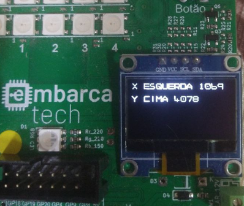

Autor: **Rodrigo Nunes Sampaio Ribeiro**

Email: **rnsribeiro@gmail.com**

Curso: Residência Tecnológica em Sistemas Embarcados

Instituição: Unicamp - EmbarcaTech - HBr

Campinas, abril de 2025

---

# Projeto: Leitura de Joystick - BitDogLab - Raspberry Pi Pico W



Este projeto implementa a leitura de um joystick analógico da placa BitDogLab (microcontrolador Raspberry Pi Pico W - RP2040), utilizando o conversor analógico-digital (ADC) do RP2040 e exibindo os valores no display OLED SSD1306. O programa foi desenvolvido em linguagem C, utilizando o Pico SDK versão 1.5.1.

## Enunciado da Atividade

O objetivo é criar um programa em C que leia os valores analógicos gerados por um joystick e exiba as informações no display OLED com as seguintes especificações:

- **Leitura do Joystick**:

  - O joystick possui dois eixos: X (esquerda/direita) e Y (cima/baixo).
  - O eixo X está conectado ao pino GPIO27 (canal ADC1) e o eixo Y ao pino GPIO26 (canal ADC0).
  - Os potenciômetros do joystick geram tensões analógicas que variam conforme o movimento:
    - Joystick no centro: \~1,65 V (meio de 3,3 V).
    - Joystick totalmente para esquerda ou baixo: \~0 V.
    - Joystick totalmente para direita ou cima: \~3,3 V.
  - O ADC do RP2040 (12 bits) converte essas tensões em valores digitais:
    - 0 V → 0.
    - 1,65 V (centro) → \~2048.
    - 3,3 V → 4095.

- **Exibição no Display OLED**:

  - O display deve mostrar a posição do joystick em cada eixo (ex.: "ESQUERDA", "CENTRO", "DIREITA" para X; "CIMA", "CENTRO", "BAIXO" para Y).
  - Além da posição, deve exibir os valores brutos lidos pelo ADC (0 a 4095) para cada eixo.
  - Formato de exibição:
    - Linha 1: "X \[posição\] \[valor\]" (ex.: "X DIREITA 4095").
    - Linha 2: "Y \[posição\] \[valor\]" (ex.: "Y CENTRO 2048").

## Funcionamento do Projeto

O projeto foi implementado com base nos requisitos acima, utilizando os seguintes componentes e lógica:

### Hardware

- **Raspberry Pi Pico W**: Microcontrolador principal, baseado no chip RP2040.
- **Joystick Analógico (BitDogLab)**:
  - Eixo X (VRX): Conectado ao pino GPIO27 (ADC1).
  - Eixo Y (VRY): Conectado ao pino GPIO26 (ADC0).
  - Alimentação: VCC (3,3 V) e GND.
- **Display OLED SSD1306**: Conectado via I2C (pinos SDA=GP14, SCL=GP15) para exibir as posições e valores do joystick.

### Software

O código foi estruturado nos seguintes arquivos:

- `main.c`: Contém a lógica principal para leitura do joystick via ADC e exibição no display OLED.
- `ssd1306_i2c.c` **e** `ssd1306_i2c.h`: Driver para o display OLED SSD1306, responsável por inicializar o display e desenhar strings.
- `ssd1306_font.h`: Define a fonte usada para renderizar caracteres no display.
- `ssd1306.h`: Declarações das funções do driver SSD1306.
- `CMakeLists.txt`: Arquivo de configuração para compilação do projeto com o Pico SDK.

### Lógica de Funcionamento

1. **Inicialização**:

   - O programa inicializa o ADC para leitura dos pinos GPIO26 (ADC0) e GPIO27 (ADC1).
   - Inicializa o I2C para comunicação com o display OLED e configura os pinos SDA (GP14) e SCL (GP15).
   - O display OLED é configurado com uma área de renderização de 128x64 pixels.

2. **Leitura do Joystick**:

   - A função `joystick_read_axis` lê os valores analógicos dos eixos X e Y usando o ADC.
   - Os valores são armazenados como números inteiros de 0 a 4095 (12 bits).

3. **Mapeamento de Posições**:

   - A função `map_joystick_position` converte os valores do ADC em posições:
     - Eixo X: &lt; 1500 → "ESQUERDA"; 1500 a 2500 → "CENTRO"; &gt; 2500 → "DIREITA".
     - Eixo Y: &lt; 1500 → "BAIXO"; 1500 a 2500 → "CENTRO"; &gt; 2500 → "CIMA".

4. **Exibição no Display**:

   - A função `update_display` formata as informações em duas linhas:
     - Linha 1: "X \[posição\] \[valor\]" (ex.: "X DIREITA 4095").
     - Linha 2: "Y \[posição\] \[valor\]" (ex.: "Y CENTRO 2048").
   - O display é atualizado a cada 100 ms para evitar sobrecarga da CPU.

5. **Loop Contínuo**:

   - O programa lê os valores do joystick continuamente, mapeia as posições e atualiza o display em um loop infinito.

### Como Executar

1. **Configuração do Hardware**:

   - Não é necessário realizar nenhuma conexão manual, pois os pinos do joystick e do display OLED já estão conectados através da configuração da placa **BitDogLab**.
   - Alimente o Pico via USB ou outra fonte de 3,3V/5V.

2. **Compilação e Gravação**:

   - Clone o repositório do Pico SDK (versão 1.5.1) e configure a variável de ambiente `PICO_SDK_PATH`.
   - Copie os arquivos do projeto (`main.c`, `ssd1306_i2c.c`, `ssd1306_i2c.h`, `ssd1306_font.h`, `ssd1306.h`, `CMakeLists.txt`) para um diretório.
   - Crie um diretório `build`, execute `cmake ..` e `make` para compilar.
   - Grave o arquivo `.uf2` gerado no Raspberry Pi Pico.

3. **Teste**:

   - Após gravar o programa, o display OLED deve começar a exibir as posições e valores do joystick imediatamente.
   - Mova o joystick para diferentes direções (esquerda, direita, cima, baixo) e observe as mudanças no display.
   - Verifique se os valores brutos do ADC correspondem às posições esperadas:
     - Centro: \~2048.
     - Extremos (esquerda/baixo ou direita/cima): \~0 ou \~4095.

## Estrutura do Projeto

```
joystick_project/
├── main.c
├── inc/
│   ├── ssd1306_i2c.c
│   ├── ssd1306_i2c.h
│   ├── ssd1306_font.h
│   ├── ssd1306.h
├── CMakeLists.txt
```

## Dependências

- **Pico SDK 1.5.1**: Fornece as bibliotecas para o RP2040 (`pico_stdlib`, `hardware_i2c`, `hardware_adc`).
- **Ferramentas de Compilação**:
  - CMake (versão 3.13 ou superior).
  - GNU Arm Embedded Toolchain (ex.: 10.3-2021.10).
  - Compilador C (ex.: `arm-none-eabi-gcc`).

## Notas

- O projeto foi otimizado para leituras estáveis do ADC, com pequenos delays (`sleep_us`) para garantir a estabilidade das leituras analógicas.
- O display OLED usa o driver SSD1306 fornecido, com suporte para renderização de strings em uma fonte de 8x8 pixels.
- O código atualiza o display a cada 100 ms, garantindo uma interface responsiva sem sobrecarregar o microcontrolador.

Para dúvidas ou sugestões, consulte a documentação do Pico SDK ou entre em contato com o desenvolvedor.