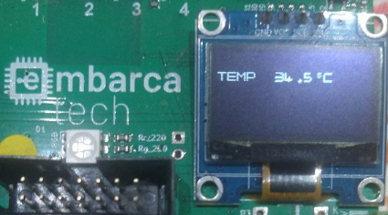

Autor: **Rodrigo Nunes Sampaio Ribeiro**

Email: **rnsribeiro@gmail.com**

Curso: Residência Tecnológica em Sistemas Embarcados

Instituição: Unicamp - EmbarcaTech - HBr

Campinas, abril de 2025

---

# Projeto: Leitura do Sensor de Temperatura Interna - BitDogLab - Raspberry Pi Pico W



Este projeto implementa a leitura do sensor de temperatura interna do microcontrolador RP2040 na placa BitDogLab (Raspberry Pi Pico W), convertendo os valores analógicos para graus Celsius e exibindo o resultado no display OLED SSD1306. O programa foi desenvolvido em linguagem C, utilizando o Pico SDK versão 1.5.1.

## Enunciado da Atividade

O objetivo é criar um programa em C que leia a temperatura interna do microcontrolador RP2040 e exiba o valor em graus Celsius no display OLED com as seguintes especificações:

- **Leitura do Sensor de Temperatura**:
  - O RP2040 possui um sensor de temperatura interno acessível via canal ADC4.
  - O sensor mede a tensão de um diodo interno (Vbe), que varia com a temperatura.
  - A conversão do valor bruto do ADC para temperatura deve ser feita com base nas especificações do datasheet.

- **Exibição no Display OLED**:
  - O display deve mostrar a temperatura em graus Celsius no formato "Temp: XX.XºC" (ex.: "Temp: 25.5ºC").
  - Para isso, a biblioteca SSD1306 foi modificada para suportar os caracteres "." (ponto decimal) e "º" (símbolo de grau).

## Informações do Datasheet

As informações sobre o sensor de temperatura interno do RP2040 foram obtidas do datasheet oficial do RP2040, disponível no site da Raspberry Pi Foundation:

- **Seção 4.9.2 - ADC and Temperature Sensor** (páginas 572-573):
  - O sensor de temperatura é acessível pelo canal ADC4.
  - A 27°C, a tensão medida é aproximadamente 0,706 V.
  - A tensão varia em -1,721 mV por grau Celsius (ou seja, diminui 1,721 mV por °C acima de 27°C e aumenta na mesma proporção abaixo).
  - Fórmula de conversão: `T = 27 - (V - 0.706) / 0.001721`, onde `V` é a tensão medida.
  - O ADC do RP2040 (12 bits) retorna valores de 0 a 4095, correspondendo a 0 a 3,3 V, então a tensão é calculada como: `V = (ADC_value * 3.3) / 4095`.

## Alterações na Biblioteca SSD1306

Para exibir a temperatura no formato "Temp: XX.XºC", a biblioteca SSD1306 foi modificada para incluir os caracteres "." (ponto decimal) e "º" (símbolo de grau):

- **Modificação em `ssd1306_font.h`**:
  - Adicionados dois novos caracteres ao array `font[]`:
    - "." (índice 37): Representado como `0x00, 0x00, 0x00, 0x40, 0xe0, 0x40, 0x00, 0x00` (um pequeno retângulo vertical nas colunas 3 a 5, linhas 5 a 7, formando um ponto mais robusto na parte inferior da grade 8x8).
    - "º" (índice 38): Representado como `0x00, 0x00, 0x00, 0x05, 0x09, 0x05, 0x00, 0x00` (um pequeno círculo na parte superior da grade 8x8, colunas 3 a 5, linhas 0 a 3, simulando o símbolo de grau).
- **Modificação em `ssd1306_i2c.c`**:
  - A função `ssd1306_get_font` foi ajustada para mapear:
    - O caractere '.' (ponto) para o índice 37.
    - O caractere '^' para o índice 38, representando o símbolo "º". Assim, no código, usamos '^' para exibir o símbolo de grau (ex.: `"25.5^C"` é renderizado como "25.5ºC").

## Funcionamento do Projeto

O projeto foi implementado com base nos requisitos acima, utilizando os seguintes componentes e lógica:

### Hardware

- **Raspberry Pi Pico W**: Microcontrolador principal, baseado no chip RP2040, que possui o sensor de temperatura interno.
- **Display OLED SSD1306**: Conectado via I2C (pinos SDA=GP14, SCL=GP15) para exibir a temperatura em graus Celsius.

### Software

O código foi estruturado nos seguintes arquivos:

- `main.c`: Contém a lógica principal para leitura do sensor de temperatura interna via ADC, conversão para graus Celsius e exibição no display OLED.
- `ssd1306_i2c.c` **e** `ssd1306_i2c.h`: Driver para o display OLED SSD1306, responsável por inicializar o display e desenhar strings.
- `ssd1306_font.h`: Define a fonte usada para renderizar caracteres no display (modificado para incluir "." e "º").
- `ssd1306.h`: Declarações das funções do driver SSD1306.
- `CMakeLists.txt`: Arquivo de configuração para compilação do projeto com o Pico SDK.

### Lógica de Funcionamento

1. **Inicialização**:
   - O programa inicializa o ADC e habilita o sensor de temperatura interno do RP2040 (canal ADC4).
   - Inicializa o I2C para comunicação com o display OLED e configura os pinos SDA (GP14) e SCL (GP15).
   - O display OLED é configurado com uma área de renderização de 128x64 pixels.

2. **Leitura do Sensor de Temperatura**:
   - A função `read_temperature` lê o valor bruto do ADC (0 a 4095).
   - Converte o valor bruto para tensão: `V = (ADC_value * 3.3) / 4095`.
   - Converte a tensão para temperatura usando a fórmula do datasheet: `T = 27 - (V - 0.706) / 0.001721`.

3. **Exibição no Display**:
   - A função `update_display` formata a temperatura em uma string no formato "Temp: XX.X^C" (ex.: "Temp: 25.5^C"), que é renderizada como "Temp: 25.5ºC" graças às modificações na biblioteca SSD1306.
   - A temperatura é exibida na linha 2 do display (centralizada verticalmente) e atualizada a cada 1 segundo.

4. **Loop Contínuo**:
   - O programa lê a temperatura e atualiza o display continuamente, com um intervalo de 1 segundo entre as leituras.

### Como Executar

1. **Configuração do Hardware**:
   - Não é necessário realizar nenhuma conexão manual, pois o sensor de temperatura é interno ao RP2040 e o display OLED já está conectado através da configuração da placa **BitDogLab**.
   - Alimente o Pico via USB ou outra fonte de 3,3V/5V.

2. **Compilação e Gravação**:
   - Clone o repositório do Pico SDK (versão 1.5.1) e configure a variável de ambiente `PICO_SDK_PATH`.
   - Copie os arquivos do projeto (`main.c`, `ssd1306_i2c.c`, `ssd1306_i2c.h`, `ssd1306_font.h`, `ssd1306.h`, `CMakeLists.txt`) para um diretório.
   - Crie um diretório `build`, execute `cmake ..` e `make` para compilar.
   - Grave o arquivo `.uf2` gerado no Raspberry Pi Pico.

3. **Teste**:
   - Após gravar o programa, o display OLED deve começar a exibir a temperatura interna do RP2040 imediatamente (ex.: "Temp: 25.5ºC").
   - Verifique se a temperatura exibida está dentro de uma faixa razoável (geralmente entre 20°C e 40°C, dependendo do ambiente e do calor gerado pelo chip).
   - A temperatura deve atualizar a cada 1 segundo.

## Estrutura do Projeto

```
sensor_temp_intenal/
├── main.c
├── inc/
│   ├── ssd1306_i2c.c
│   ├── ssd1306_i2c.h
│   ├── ssd1306_font.h
│   ├── ssd1306.h
├── CMakeLists.txt
```

## Dependências

- **Pico SDK 1.5.1**: Fornece as bibliotecas para o RP2040 (`pico_stdlib`, `hardware_i2c`, `hardware_adc`).
- **Ferramentas de Compilação**:
  - CMake (versão 3.13 ou superior).
  - GNU Arm Embedded Toolchain (ex.: 10.3-2021.10).
  - Compilador C (ex.: `arm-none-eabi-gcc`).

## Notas

- **Precisão do Sensor**: O sensor de temperatura interna do RP2040 mede a temperatura do chip, que pode ser mais alta que a temperatura ambiente devido ao calor gerado pelo próprio microcontrolador. Para maior precisão, pode ser necessário calibrar os valores.
- **Biblioteca SSD1306**: As modificações feitas permitem a exibição de temperaturas com ponto decimal e o símbolo de grau, mas a fonte 8x8 pixels limita o design do caractere "º" a uma aproximação (um pequeno círculo).
- **Performance**: O código atualiza o display a cada 1 segundo, garantindo uma interface responsiva sem sobrecarregar o microcontrolador.

Para dúvidas ou sugestões, consulte a documentação do Pico SDK ou entre em contato com o desenvolvedor.